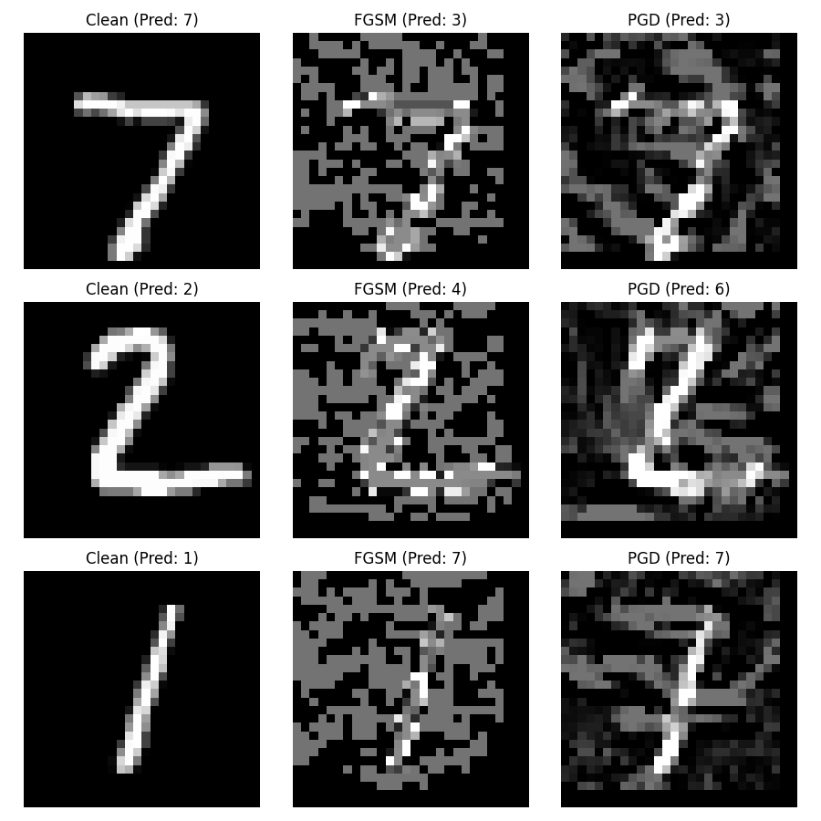
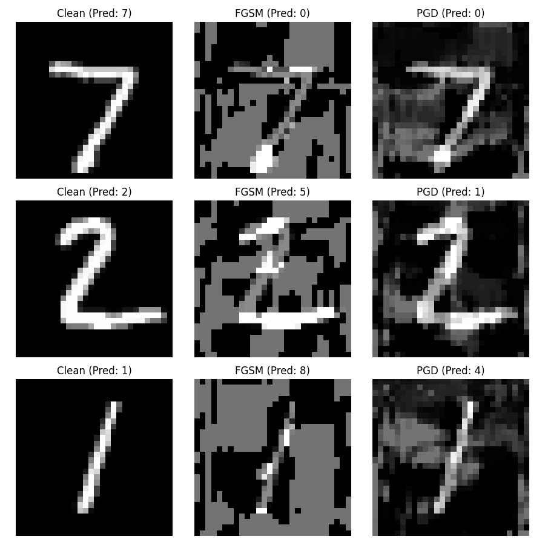
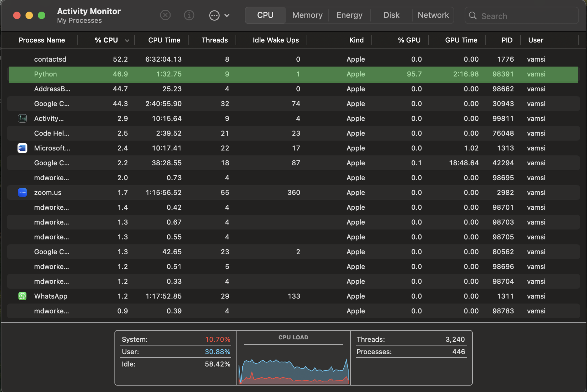

# Adversarial Attacks on Deep Learning Models

Exploring the concept of "adversarial attacks" on deep learning models, specifically focusing on image classification using PyTorch. Implementing and demonstrating the Fast Gradient Sign Method (FGSM) and Projected Gradient Descent (PGD) attacks against a Convolutional Neural Network (CNN) and a Recurrent Neural Network (RNN) trained on the MNIST dataset.

## Overview

Deep learning models, despite their high accuracy, are known to be vulnerable to adversarial examples – subtly perturbed inputs designed to cause misclassification. This project aims to:
* Train basic CNN, RNN models for MNIST digit classification.
* Implement common gradient-based adversarial attacks (FGSM and PGD).
* Visualize the original images, the adversarial perturbations, and the model's predictions to understand the impact of these attacks.
* Develop defense mechanisms like adversarial training and gradient masking training to improve model accuracies for FGSM and PGD.

## Features

* CNN model definition and training on MNIST using PyTorch.
* Implementation of the FGSM attack.
* Implementation of the PGD attack.
* Visualization script to compare clean images, adversarial images, and model predictions side-by-side.
* Implementation of Adversarial Training defense.
* IMplementation of Gradient Masking Training defense.

## Example Visualization

*Example output showing clean digits vs. FGSM/PGD perturbed digits and the model's predictions:*

### Adversarial Examples

<!--   -->

<table align="center">
  <tr align="center">
    <td>CNN</td>
     <td>RNN</td>
  </tr>
  <tr align="center">
    <td></td>
    <td></td>
  </tr>
 </table>

## Requirements

* Python (3.13)
* [uv](https://github.com/astral-sh/uv) (for environment and package management)
* Git

## Installation

1.  **Clone the repository:**
    ```bash
    git clone https://github.com/Vamsi-Dath/Adversarial-Attacks-on-Deep-Learning-Models.git
    cd Adversarial-Attacks-on-Deep-Learning-Models
    ```

2.  **Create a virtual environment:**
    ```bash
    uv venv
    ```

3.  **Activate the virtual environment:**
    * Bash/Zsh (Linux/macOS): `source .venv/bin/activate`
    * Fish (Linux/macOS): `source .venv/bin/activate.fish`
    * Cmd (Windows): `.venv\Scripts\activate.bat`
    * PowerShell (Windows): `.venv\Scripts\Activate.ps1`

4.  **Install dependencies:**
    ```bash
    uv sync
    ```

## 
**Run:** `main.py`

```bash
uv run main.py
```
for printing results as ***command line output***

(or)
```
PYTHONUNBUFFERED=1 uv run main.py 2>&1 | tee output.txt 
```
for saving results as ***output.txt***

## Sample run on mac



## Output

Refer to the command line outputs (or) output.txt

